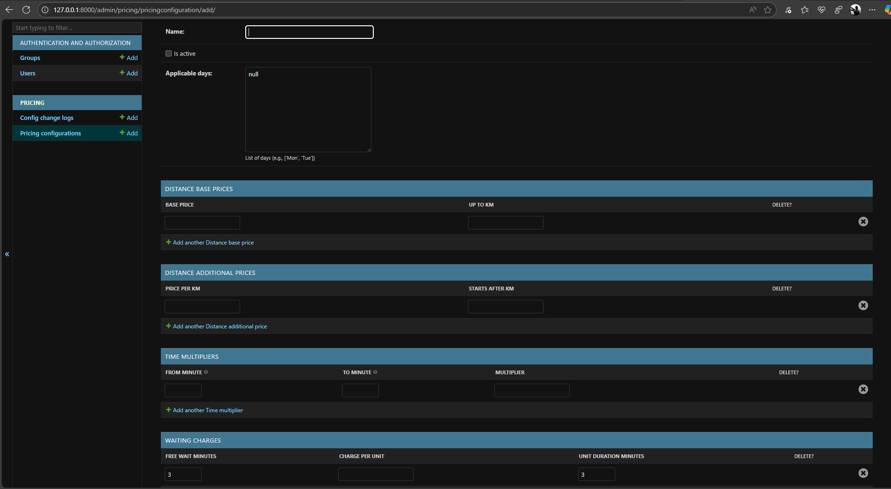

# 🚖 Django Ride Pricing Module

A flexible and extensible ride-pricing backend inspired by Uber/Ola-style fare systems. Built with Django, it dynamically computes fares based on distance, ride duration, waiting time, and configurable pricing rules.


---

## 📌 Features

- 💼 Dynamic **Pricing Configuration Management** (via Admin panel)
- 🧮 Fare calculation logic based on:
  - Base price & distance slabs
  - Time-based multipliers
  - Waiting charges
- 🛠️ Configuration via Django forms with validation
- 🕒 **Change logs** for audit trail (timestamp & user)
- 🔒 Ensures only one active pricing configuration at a time
- ⚙️ Robust edge-case handling

---

## 🛠️ Setup Instructions

### 1. Clone the Repository

```bash
git clone https://github.com/kushAnkit/ride-pricing-module
cd ride-pricing-module
```

### 2. Set Up Virtual Environment

```bash
python -m venv venv
# On Windows
venv\Scripts\activate
# On macOS/Linux
source venv/bin/activate
```

### 3. Install Dependencies

```bash
pip install -r requirements.txt
```

### 4. Run Migrations & Start Server

```bash
cd ride_pricing
python manage.py makemigrations
python manage.py migrate
python manage.py createsuperuser  # optional: for admin access
python manage.py runserver
```

---

## 🔌 API Usage

### 🎛️ Admin Panel & Configuration Forms

- **URL:** `/admin`
- Use Django admin to:
  - Create/edit pricing configurations
  - View change logs
  - Manage time multipliers and wait charges

### 🚦 Fare Calculation Endpoint

- **URL:** `/api/pricing/calculate-fare/`  
- **Method:** `GET`

#### Query Parameters:

| Param     | Type   | Description                          |
|-----------|--------|--------------------------------------|
| distance  | float  | Distance traveled (in km)            |
| time      | int    | Duration of ride (in minutes)        |
| wait      | int    | Waiting time (in minutes)            |

#### Example:

```
GET /api/pricing/calculate-fare/?distance=12.5&time=80&wait=7
```

#### Response:

```json
{
  "total_fare": 178.75
}
```

---

## 🧪 Running Tests

```bash
python manage.py test
```

---

## 🖼️ Screenshot



---

